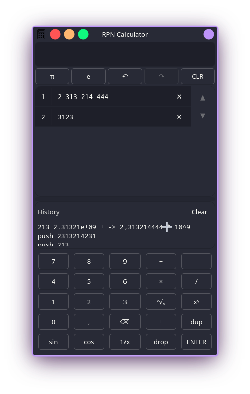

# RpnCalcQuick - RPN Calculator

RpnCalcQuick is a modern Reverse Polish Notation (RPN) calculator built with **C++20** and **Qt 6**. It features a robust Model-View-ViewModel (MVVM) architecture, combining high-performance C++ core logic with a responsive Qt Quick (QML) interface.

Designed to be lightweight and keyboard-friendly, it fits perfectly on your desktop alongside other windows.



## Features

### Core Functionality
* **RPN Logic:** Classic stack-based calculation method (no parentheses needed).
* **Dynamic Stack:** View calculations in real-time. Supports scrolling, moving items, and removing specific entries.
* **Precision Control:**
    * **Scientific:** Standard scientific notation (e.g., `1.23e+5`).
    * **Engineering:** Exponents are multiples of 3.
    * **Simple:** Standard decimal notation with grouping.
    * Configurable precision limit (protected globally to 15 digits to ensure accuracy).

### User Interface
* **History Log:** A scrollable text log of all operations (copy-paste ready).

### Advanced Interaction
* **Stack Manipulation:**
    * **In-Place Editing:** Double-click any item on the stack to edit its value directly.
    * **Drag & Drop (via Keys):** Move items up/down the stack using keyboard shortcuts.
* **Smart Input:** Intelligent keypad that adapts to window size.

## Keyboard Shortcuts

RpnCalcQuick is designed to be used without a mouse.

| Key | Action |
| :--- | :--- |
| **0-9, . ,** | Input numbers |
| **Enter / Return** | Push to Stack / Duplicate (if input empty) |
| **Backspace** | Delete last digit / Drop item |
| **+, -, *, /** | Arithmetic Operations |
| **=** | Add (Alternative for +) |
| **^** | Power ($x^y$) |
| **Shift + Up** | Move selected stack item UP |
| **Shift + Down** | Move selected stack item DOWN |
| **F2** | Edit selected stack item |
| **Ctrl + Z** | Undo |
| **Ctrl + Shift + Z** | Redo |

### Function Shortcuts (Single Key)

| Key | Function | Description |
| :--- | :--- | :--- |
| **n** | `neg` | Negate (±) |
| **d** | `dup` | Duplicate top item |
| **x** | `drop` | Remove top item |
| **i** | `inv` | 1/x (Reciprocal) |
| **s** | `sin` | Sine |
| **c** | `cos` | Cosine |
| **r** | `root` | N-th Root ($x\sqrt{y}$) |

## Requirements

* **C++ Compiler:** C++20 standard required.
* **Qt Framework:** Version 6.4 or later (Components: `QtQuick`, `QtQuick.Controls`, `Qt.labs.platform`).
* **CMake:** Version 3.16 or later.

## Build Instructions

1.  Clone the repository.
2.  Create a build directory:
    ```bash
    mkdir build
    cd build
    ```
3.  Configure the project:
    ```bash
    cmake ..
    ```
4.  Build the application:
    ```bash
    cmake --build .
    ```

## Usage Example

To calculate `(3 + 4) * 5`:

1.  Type `3`, press `Enter`.
2.  Type `4`, press `+`. (Stack shows `7`)
3.  Type `5`, press `*`. (Stack shows `35`)

To calculate $\sqrt{2}$:

1.  Type `2`, press `Enter`.
2.  Type `2` (for square root) or use the shortcut `r` if the base and root degree are on stack. 
    *(Alternatively: `2` `Enter` `0.5` `^`)*

## License

[GPL v3](LICENSE)
